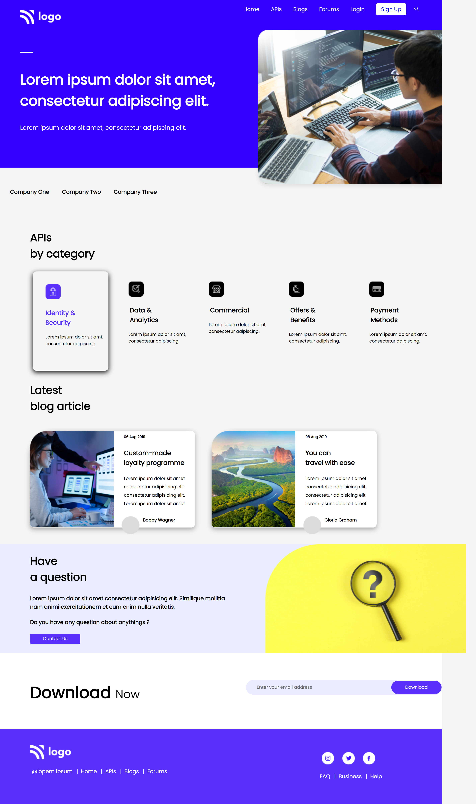
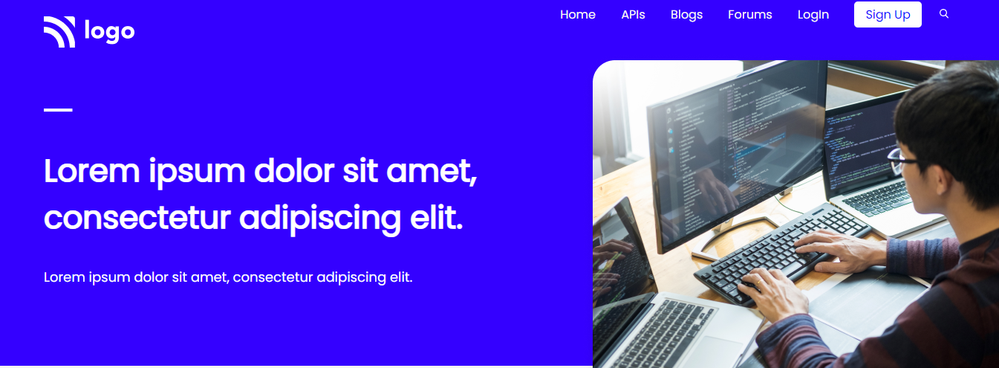
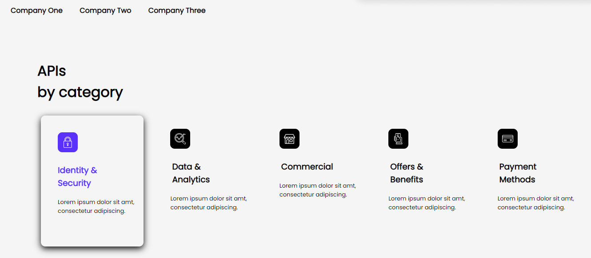
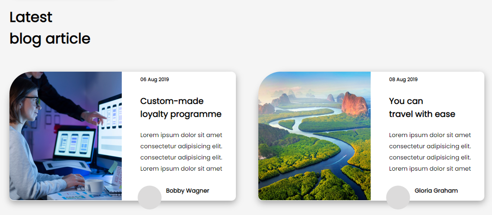

# Project No. 9 (API Project)

This is my _**9th project**_ of Web Development which is a mobile responsive too. The project is designed in such a way that it works on large(Desktop & Laptop) as well as small screens(Mobile Devices). In this project I have learnt a lot of new concepts of CSS like _**display and float properties,  Media Queries, how to override properties on media queries, Flex properties and uses, box-shadow property**_ etc. 

> [Check out the deployed link](https://project-9-by-noman.netlify.app/)

FULL WEBPAGE:

NAVBAR:

BODY:

# Technologies Used

## What I leaned

- How to position elements in CSS.
- Box-shadow property in CSS.
- Writing Media Queries.
- How to make a website responsive.
- How to use Flex property efficiently.

# Connect with me

   &ensp;
  &ensp;
  &ensp;
  
